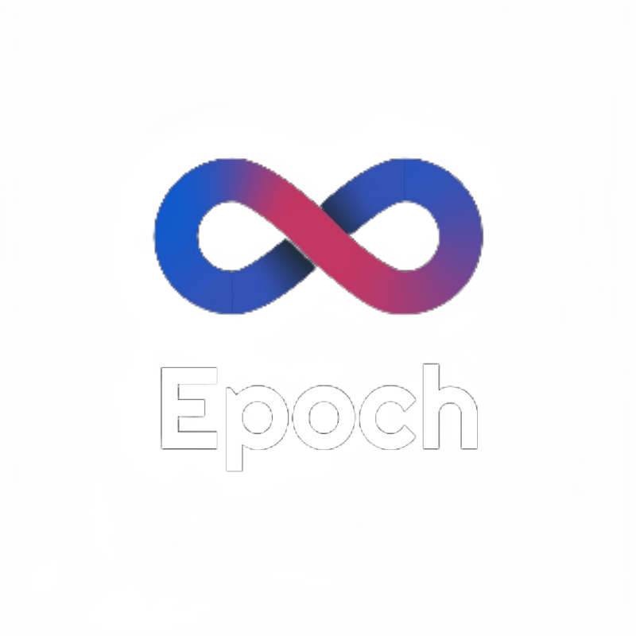

  

# Epoch Website

The community platform for Epoch at IIIT Sri City. It brings the club's writing, projects, events, photo galleries, and team history together in one place, with member accounts and a dedicated admin workspace for running the community.

## What you can do

- Read community blogs and discover featured projects.
- Browse upcoming events, register online, and download a PDF ticket with a QR code.
- Explore event photo galleries with a full-image viewer.
- Meet the current team and browse previous academic years.
- Create a stable, shareable profile card for published team members.
- Sign in to manage your profile, registrations, and team-directory requests.
- Contact the Epoch team through an authenticated form.

Administrators can manage content, users, event registrations, contact queries, team records, and downloadable QR codes from a responsive dashboard. Administrative creates, updates, and deletes are also recorded in a searchable audit log.

## Built with

- [Next.js](https://nextjs.org/) App Router, React, and TypeScript
- [Tailwind CSS](https://tailwindcss.com/) and Radix UI primitives
- [MongoDB](https://www.mongodb.com/) with Mongoose
- [NextAuth.js](https://next-auth.js.org/) with Google OAuth
- [Cloudinary](https://cloudinary.com/) for managed images
- PDFKit and QRCode for event tickets and admin utilities

## Project structure

| Directory | Purpose |
| --- | --- |
| `app/` | Public pages, member/admin pages, and API route handlers |
| `components/` | Shared layouts, interface components, and feature UI |
| `lib/` | Authentication, validation, database, dates, audit, media, and ticket helpers |
| `models/` | Mongoose data models |
| `public/` | Static brand and animation assets |
| `scripts/` | Automated tests and manual maintenance tools |

## Contributing

Start with [dev.md](dev.md) for local setup, environment variables, architecture notes, testing, and operational safeguards. Please run the relevant checks before opening a pull request, and discuss substantial behavior or schema changes in an issue first.

Never commit credentials, environment files, database exports, or real member/contact data. Report security concerns privately to the repository maintainers rather than posting sensitive details in a public issue.
